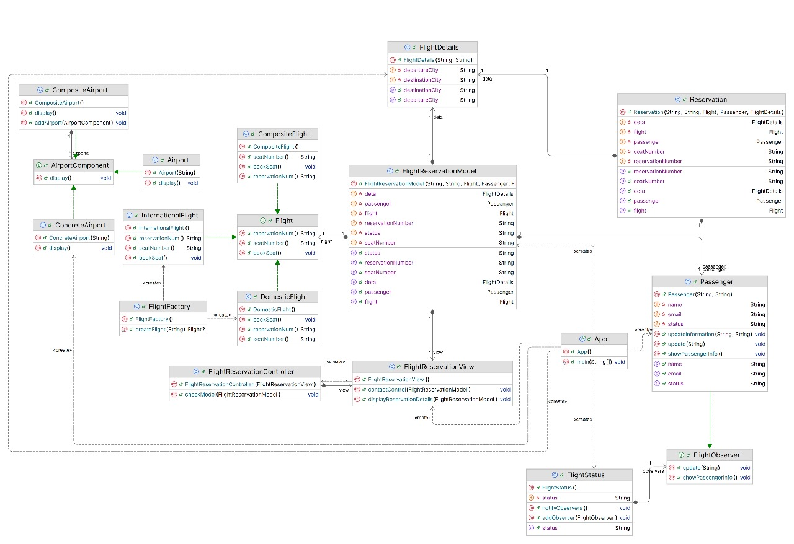

## Getting Started

Weclome to our Flight reservation System, a project for CPIT-252 "Software Engineering"

## Project Structure
The Project Build using different Patterns 
- `Structural`: Composite Pattern
- `Creational`: Factory Pattern 
- `Behavioural`: Observer Pattern
> In addition to the main model "MVC" to facilitate data flow and control flow 

## Main Functionality

- Booking Flights tickets
- Manage reservation
- Airport Scalability

## Class Diagram
 
#### Team Developers 
- Hmzh Dubh
- Hatem alharbi
- Khalid alzahrani
